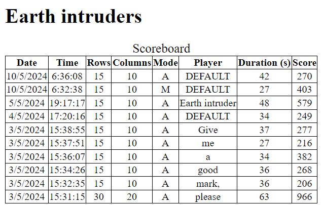

# Cloud version of the project
The cloud version of the project asks the user to insert the name of the player and uploads the data into a Firestore database.

After uploading the data it will be possible to see it in the scoreboard on the web application:


## Client
The cloud version of the project has another file called “networkFunctions” which contains a function that uploads the data to the Firestore database. This function receives the data to be uploaded in input from the main function, inserts it into a JSON object and sends it to the writing function of the server.

The values to be uploaded to the server are:
- The number of rows of the matrix
- The number of columns of the matrix
- The game mode
- The duration of the game in seconds
- The score of the game
- The name of the player

## Server
The server of the project is a Firebase project which uses a Firestore database and two web app functions: one to read the data from the database and one to write it.

The web app functions are realized using Node js and second version of the Firebase APIs.

### Deployment
To deploy the functions we need to first initialize a node js project using the following command:
```
npm init -y
```
Then we install the dependencies of the application:
```
npm install @google-cloud/firestore firebase firebase-admin firebase-functions
```
After installing Firebase we need to login into a Google account using the following command:
```
firebase login
```
Now we can initialize the Firebase project inside the folder and choose to develop functions:
```
firebase init
```
Now we can develop our functions and, once we finish, we can deploy them to the Firebase server using the following command:
```
firebase deploy
```
After successfully deploying the functions, the firebase server will provide the links to access them. We can put the URL of the writing function in the parameters of the client and start using our project!