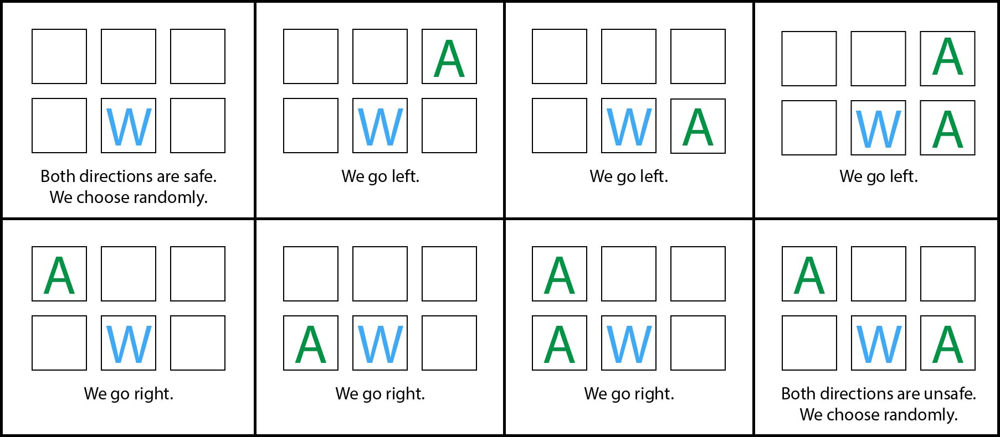

# Intermediate version of the project
The intermediate version of the project has an improved function for the automatic movement. This function is made such that the player would avoid moving in a direction that would cause them to receive damage if it is possible to do so.
To understand how it works let us look at the following picture:

First, we need to consider that if the player is in a corner of the matrix, we must make it move towards the center.
If the player can move left or right, we need to establish if the directions are safe or unsafe. To do so we need to consider that the player will receive damage if either they move on top of an alien or they move under an alien because, in such case, they will receive advancement damage shortly after. For this reason, we need to consider the last row and the second last row as equally important when establishing if a direction is safe or not.
If the cells on a side of the player are both empty the direction is safe, otherwise it is not.
Let us see the following table:

| leftSafe | rightSafe | Action |
| -------- | --------- | ------ |
| No | No | We move randomly |
| No | Yes | We move right |
| Yes | No | We move left |
| Yes | Yes | We move randomly |

From the table we can see that if `leftSafe == rightSafe` we need to generate a random number and use it to generate a direction. Otherwise, we can simply choose the safe direction.